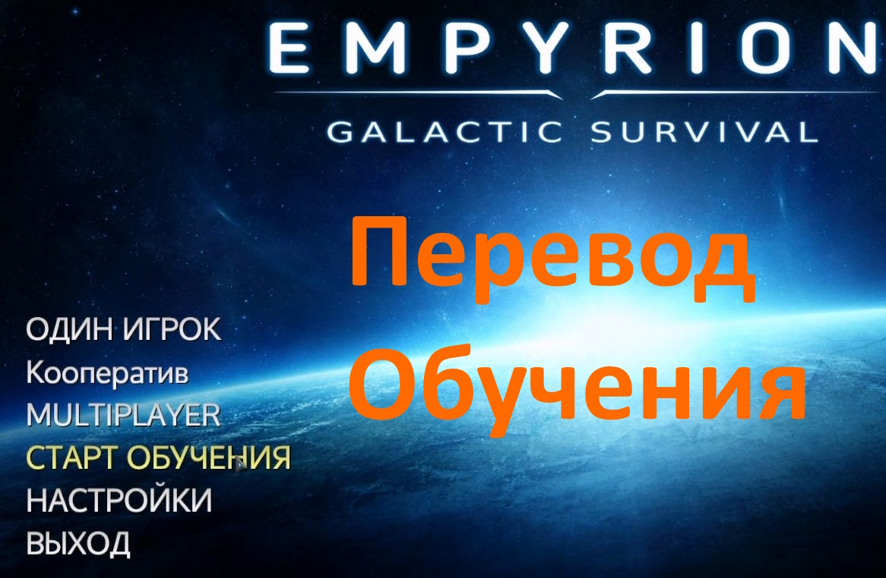

# Translate-Guided-tutorial-for-Empyrion---Galactic-Survival
Перевод на Русский язык Основного обучения, то что с главного меню. Empyrion - Galactic Survival. Теоретически возможен перевод на любой другой язык.

## Видео демонстрации

## Видео демонстрации

В папке "Empyrion - Galactic Survival Перевод обучения" находятся только файлы с уже готовым переводом.
1. файл "Dialogues.csv"
должен быть в папке "C:\Program Files (x86)\Steam\steamapps\common\Empyrion - Galactic Survival\Content\Scenarios\Guided Tutorial\Content\Configuration"
2. файл "PDA.csv"
должен быть в папке "C:\Program Files (x86)\Steam\steamapps\common\Empyrion - Galactic Survival\Content\Scenarios\Guided Tutorial\Extras\PDA"
3. оба файла копировать с заменой.

В папке "Empyrion - Galactic Survival Программа перевода обучения" находятся скрипты для перевода, в нем нет самих файлов с английским текстом из игры.
Переводить надо два файла "PDA.csv" и "Dialogues.csv".
"Dialogues.csv" - это диалоги капитана и робота Галилео.
"PDA.csv" - тут основные тексты обучения.

Инструкция как пользоваться скриптами в самих папках со скриптами.
--------------
если скрипт не запускается, то видимо не установлен питон. установи его.
